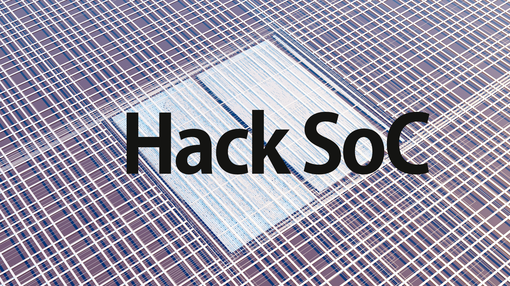
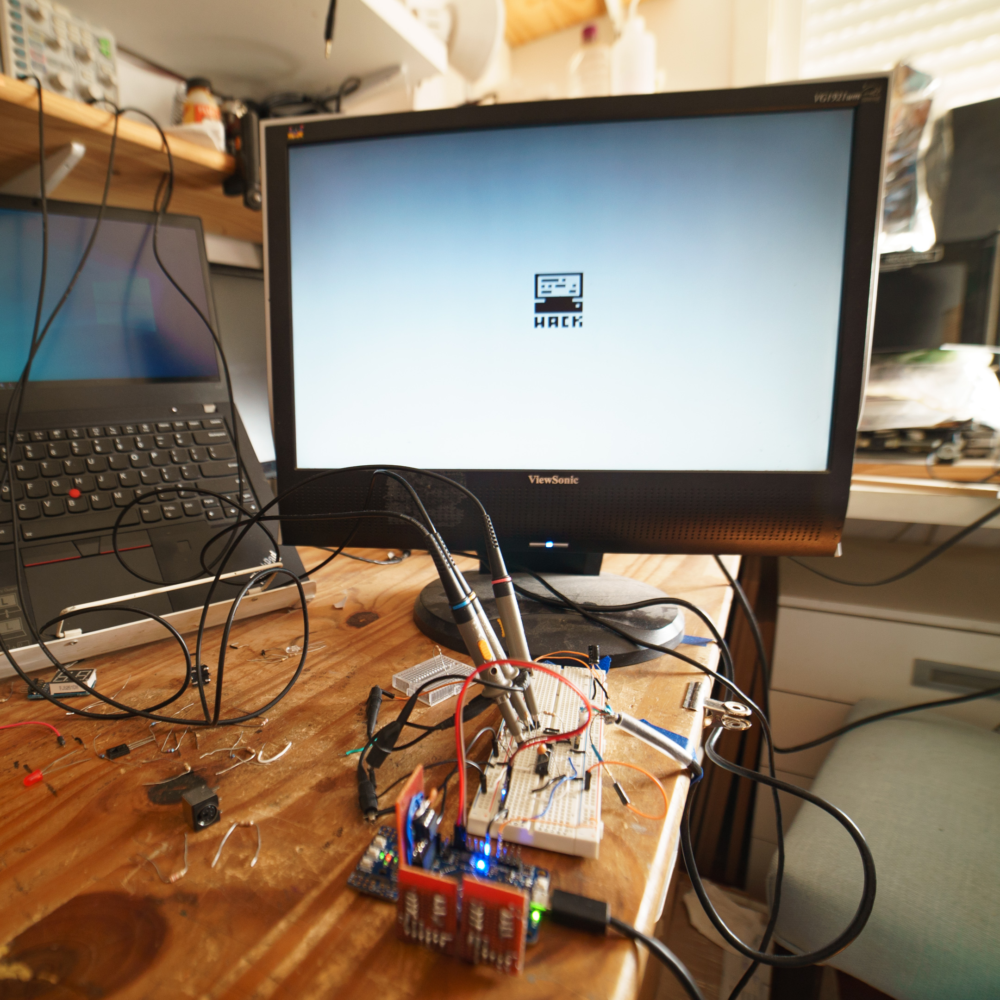

# Hack SoC

[](https://opensource.org/licenses/Apache-2.0)

## Hardware implementation of the Hack Computer from the Nand to Tetris courses




 

---
### HACK Computer
Official website of Nand to Tetris courses: 
https://www.nand2tetris.org/

Some details of the original HACK Computer:
```
HACK	
16bit Computer	
Harvard architecture: separate Program & Data memory	
32 KBytes ROM	
32 KBytes Addressable RAM:	
	16 KBytes GENERAL RAM
	8 KBytes VRAM
	1 Bytes Keyboard input memory map
```

---


This repository is based on the example caravel_user_project.
Refer to [README](docs/source/quickstart.rst) for a quick start of how to use caravel_user_project

